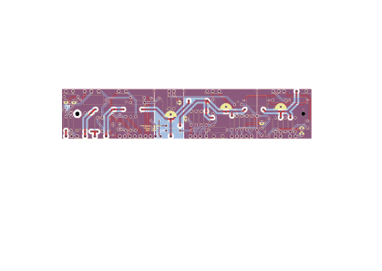

# Yet another modded Princeton Reverb

I started off with a Modulus Amplification Princetown Reverb kit. That should have been it. But I wanted to do some of the mods people do, as well as incorporate some of the things Merlin Blencowe suggests in his books.

Initially, I thought I could get away with altering the supplied turret board. Alas, that was just taking up too much thinking time. It was far easier to just draw up a PCB.

Things I've done:

- moved the reverb to its own node
- moved the LFO to its own spur
- used an LED to bias the LFO
- added a large stopper to the PI grid
- reduced the PI coupling caps going to the 6V6s (I could reduce further, but we'll see)
- adopted a multi-star grounding scheme using ground planes for each node, that daisy chain from the reservoir cap to the input
- a single earth <-> signal ground connection near the input
- tried to make the off-board connections short
- it's all on one board! No need for a bias board.

## Things that could do with improving

Should anyone want to take this and make it better, I'd add another mounting hole somewhere in the middle. 

## Licence

This project is licensed under **Creative Commons Attribution-NonCommercial-ShareAlike 4.0 International (CC BY-NC-SA 4.0)**.

© 2026 Tristan Collins

### You are free to:
- **Use and study** the design for personal, educational, or research purposes
- **Adapt** — remix, modify, or build upon it
- **Share** — redistribute in any medium or format

### Under these conditions:
- **Attribution** — credit the original, link to the licence, note any changes
- **NonCommercial** — may not be used for commercial purposes without permission
- **ShareAlike** — adaptations must be released under the same licence

### Commercial use
If you want to manufacture or sell PCBs, kits, or assemblies based on this design, you need a commercial licence. Get in touch: **hard.zoo4108@fastmail.com**

Full licence text: [LICENSE](./LICENSE)
